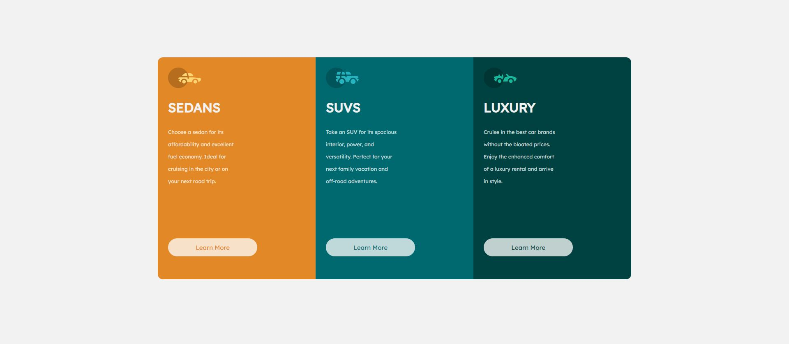

# Frontend Mentor - 3-column preview card component solution

This is a solution to the [3-column preview card component challenge on Frontend Mentor](https://www.frontendmentor.io/challenges/3column-preview-card-component-pH92eAR2-). Frontend Mentor challenges help you improve your coding skills by building realistic projects. 

## Table of contents

- [Overview](#overview)
  - [The challenge](#the-challenge)
  - [Screenshot](#screenshot)
  - [Links](#links)
- [My process](#my-process)
  - [Built with](#built-with)
  - [Continued development](#continued-development)
  - [Useful resources](#useful-resources)
- [Author](#author)

**Note: Delete this note and update the table of contents based on what sections you keep.**

## Overview

### The challenge

Users should be able to:

- View the optimal layout depending on their device's screen size
- See hover states for interactive elements

### Screenshot

 - Desktop Screenshot
 - Mobile Screenshot

### Links

- Solution URL: [Solution](https://njabz-1.github.io/3-Column-Preview-Card/)

## My process

### Built with

- Semantic HTML5 markup
- CSS custom properties
- Flexbox
- Mobile-first workflow

### Continued development

Static pages are simple enough, want to work on more dynamic pages.

### Useful resources

- [Responsive Web Design](https://www.w3schools.com/css/css_rwd_mediaqueries.asp) - This page helped with builfing for different screen sizes. 

- [Hover Selector](https://www.w3schools.com/csSref/sel_hover.asp) - W3schools paged that helped with creating the hover state

## Author

Myself :)

